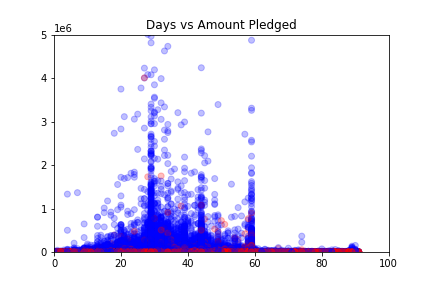
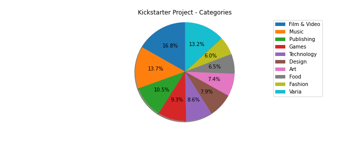
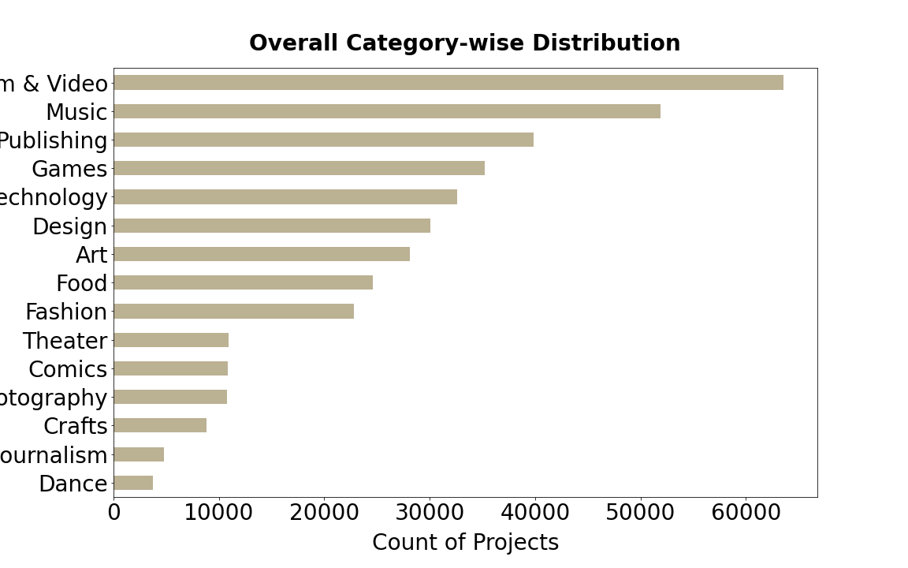
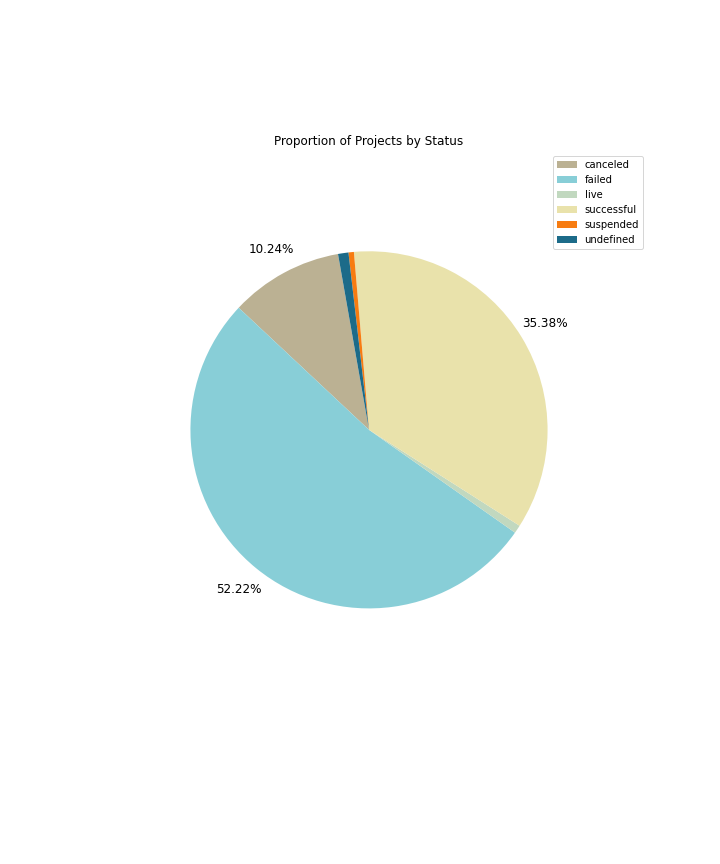

# **KICKPLOT STARTER**
## **A data analysis of KICKSTARTER dataset 2018 by *Bernard* and *Sanjay*.**

### **In this project you will find 4 different presentations**

1: **Scatter plot**: Successful (blue) vs. Failed (red)  

The x -axis shows the amount of days.  The y -axis shows the amount in millions of dollars.  

2: **Pie chart**: Categories & Percentages

3: **Histogram**: Overal Category-wise Distribution  

4: **Pie chart**: Proportion of Pojects by Status  

### ***We made use of Pandas, Numpy, Matplotlib, Seaborn & InteractiveShell
source: https://www.kaggle.com/kemical/kickstarter-projects

We chose this subject because of a common kickstarter interest.  Kind regards.

28 Oktober 2020
